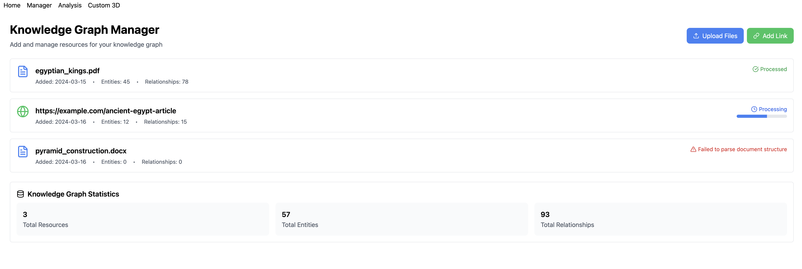
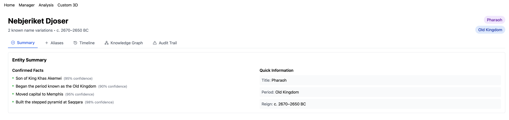
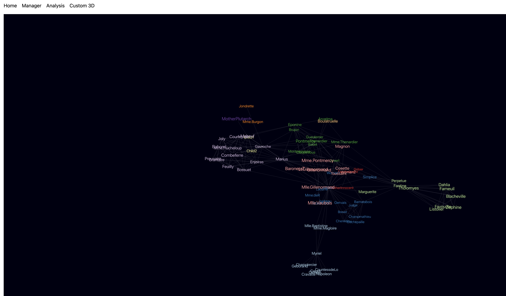

# Knowledge Graph

## Overview
The Knowledge Graph application is a web-based tool designed to visualize and analyze relationships between entities in a structured format. It leverages 3D graph visualization to represent complex data, making it easier to understand connections and hierarchies.

## Project Details
The Knowledge Graph project focuses on representing historical and literary entities and their relationships, particularly from the context of classic literature. The application allows users to explore connections between characters, events, and locations, providing insights into the narrative structure and character interactions.

### Key Components
- **Custom 3D Visualization**: The application uses `react-force-graph-3d` to create an interactive 3D graph that displays nodes (entities) and edges (relationships) dynamically.
- **Entity Analysis Dashboard**: Users can select an entity to view detailed information, including aliases, historical facts, and a visual representation of its relationships.
- **Knowledge Graph Manager**: This feature allows users to upload documents and links, which are processed to extract relevant entities and relationships, enriching the knowledge graph.
- **Responsive Design**: Built with Tailwind CSS, the application is designed to be user-friendly and accessible on various devices.

## Features
- **3D Graph Visualization**: Interactive representation of entities and their relationships.
- **Entity Analysis Dashboard**: Detailed insights into individual entities.
- **Knowledge Graph Manager**: Upload and manage resources for the knowledge graph.
- **Responsive Design**: Modern UI built with Tailwind CSS.

## Technologies Used
- **Frontend**: React, Vite, Tailwind CSS
- **3D Visualization**: Three.js, react-force-graph-3d
- **Icons**: Lucide React
- **State Management**: React Hooks

## Installation
To set up the project locally, follow these steps:

1. **Clone the repository**:
   ```bash
   git clone <repository-url>
   cd knowledge-graph
   ```

2. **Install dependencies**:
   ```bash
   npm install
   ```

3. **Run the application**:
   ```bash
   npm run dev
   ```

4. **Access the application**: Open your browser and navigate to `http://localhost:4173`.

## Usage
- Navigate through the application using the links provided in the header.
- Use the **Knowledge Graph Manager** to upload files or add links for processing.
- Explore the **Entity Analysis Dashboard** to view detailed information about specific entities.
- Interact with the 3D graph to visualize relationships between entities.

## Docker Setup
To run the application using Docker, follow these steps:

1. **Build the Docker image**:
   ```bash
   docker-compose build
   ```

2. **Run the Docker container**:
   ```bash
   docker-compose up
   ```

3. **Access the application**: Open your browser and navigate to `http://localhost:4173`.

## Images
Here are some screenshots of the application in action:

### Knowledge Graph Manager


### Entity Analysis Dashboard


### 3D Graph Visualization


## License
This project is licensed under the MIT License. See the [LICENSE](LICENSE) file for details.

## Contributing
Contributions are welcome! Please open an issue or submit a pull request for any enhancements or bug fixes.
